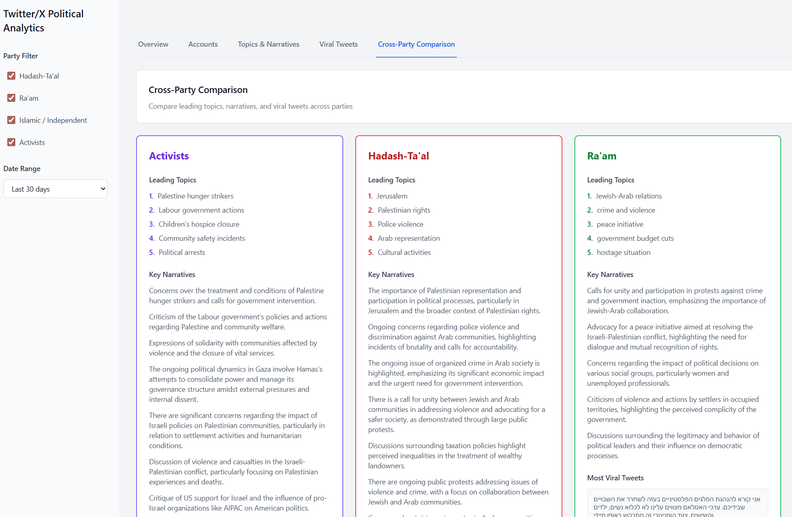
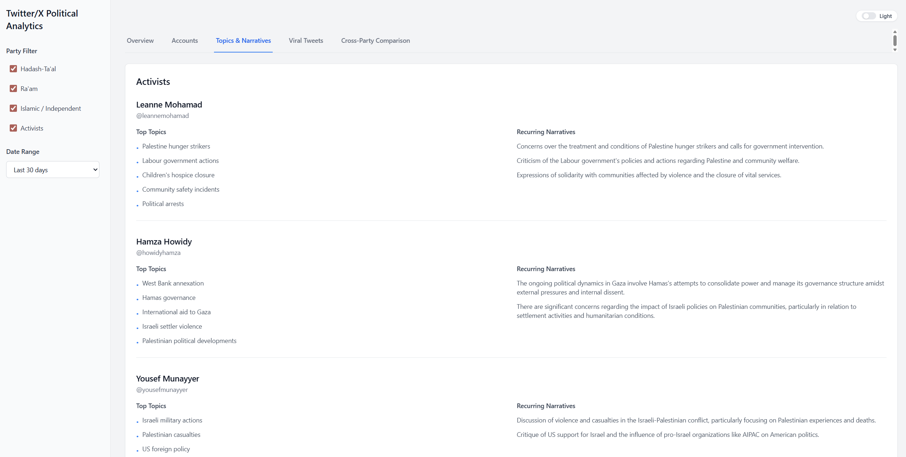
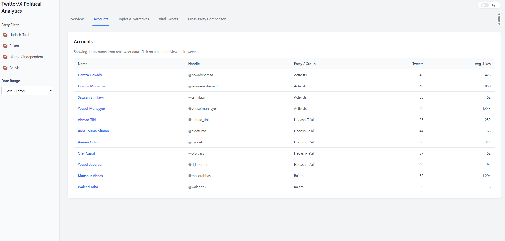

# Twitter/X Political Analytics Dashboard

A full-stack analytics dashboard for analyzing political Twitter/X data from curated accounts. Built with **Next.js**, **React**, **TypeScript**, and **Tailwind CSS** on the frontend, with an offline **Python** data pipeline for scraping and normalizing tweet data.

## Screenshots

| Overview | Accounts & Viral Tweets | Topics & Cross-Party |
|----------|-------------------------|----------------------|
|  |  |  |

---

## Overview

This project provides an internal-style analytics dashboard to:

- **Collect** recent tweets from a curated list of political accounts (Hadash–Ta'al, Ra'am, Islamic/Independent, Activists)
- **Normalize** raw data from snscrape or Apify into a consistent JSON/CSV format
- **Visualize** KPIs, party-level metrics, per-account stats, and viral tweets in a clean, filterable UI

The dashboard supports **party filtering**, **date range** selection (UI-ready), **dark/light theme**, and reads from precomputed data files under `data/`, keeping the frontend decoupled from the data collection layer.

---

## Tech Stack

| Layer | Technologies |
|-------|--------------|
| **Frontend** | Next.js 14 (App Router), React 18, TypeScript, Tailwind CSS, Recharts |
| **Data pipeline** | Python 3.x, snscrape, pandas; optional Apify Tweet Scraper output processing |

---

## Features

### Dashboard Tabs

- **Overview** – KPI cards (Total Accounts, Total Tweets, Average Likes, Average Engagement) and a bar chart of tweets per party
- **Accounts** – Table of accounts with username, display name, party, follower count, tweet count, and average likes; click an account to open a **modal** with that account’s tweets
- **Viral Tweets** – Sortable table of tweets with engagement metrics and links to original posts
- **Topics & Narratives** – Per-account view of top topics and narratives, powered by `data/topics_and_narratives.json`
- **Cross-Party Comparison** – Side-by-side comparison of topics and narratives across selected parties, with engagement context

### Filters & UX

- **Party filter** – Multi-select for Hadash-Ta'al, Ra'am, Islamic/Independent, Activists
- **Date range** – UI control (e.g. last 30 days); ready for backend wiring
- **Theme toggle** – Light/dark mode
- **Responsive layout** – Fixed sidebar, scrollable main content; tuned for common laptop widths (e.g. 1280–1440px)

---

## Project Structure

```
Twitter_Political_Analytics/
├── app/
│   ├── layout.tsx          # Root layout
│   ├── page.tsx            # Main dashboard page
│   └── globals.css         # Global styles (Tailwind)
├── components/
│   ├── SidebarFilters.tsx  # Left sidebar: party + date filters
│   ├── KpiCard.tsx         # KPI metric card
│   ├── Tabs.tsx            # Tab navigation
│   ├── PartyBarChart.tsx   # Bar chart (Recharts)
│   ├── AccountsTable.tsx   # Accounts tab table
│   ├── AccountTweetsModal.tsx # Modal showing an account’s tweets
│   ├── ViralTweetsTable.tsx# Viral tweets tab table
│   ├── TopicsNarrativesView.tsx # Topics & Narratives tab
│   ├── CrossPartyComparison.tsx # Cross-Party Comparison tab
│   └── ThemeToggle.tsx     # Dark/light theme switch
├── types/
│   └── types.ts            # TypeScript interfaces (PartyStats, Tweet, AccountSummary, etc.)
├── lib/
│   └── mockData.ts         # Data access: reads data/all_tweets.json, builds dashboard + accounts + viral lists
├── data/
│   ├── all_tweets.json     # Normalized tweet data (consumed by dashboard)
│   ├── all_tweets.csv      # Same data in CSV form
│   ├── topics_and_narratives.json # Per-account topics & narratives (Topics & Cross-Party tabs)
│   ├── images/             # Screenshots for README (image.png, image2.png, image3.png)
│   └── apify_raw_tweets.json  # Optional: raw Apify scraper output (input to process_apify_tweets.py)
├── backend/
│   ├── scraping/
│   │   └── scrape_tweets.py    # Snscrape-based scraper → all_tweets.json / all_tweets.csv
│   └── process_apify_tweets.py # Converts Apify Tweet Scraper JSON → normalized all_tweets.json/CSV
├── README.md               # This file
└── README_data.md          # Data pipeline details (Python env, scraper, Apify processor)
```

---

## Getting Started

### What you need to install

- **Node.js** 18+ and **npm** (required to run the dashboard)
- **Python** 3.8+ (optional; only needed if you want to run the data pipeline to generate or update tweet data)

### How to run the project

1. **Clone the repo** (if you haven’t already) and open a terminal in the project root.

2. **Install dependencies** (one-time):

   ```bash
   npm install
   ```

3. **Start the development server**:

   ```bash
   npm run dev
   ```

4. Open **[http://localhost:3000](http://localhost:3000)** in your browser. The dashboard reads from:
   - `data/all_tweets.json` – tweet data (Overview, Accounts, Viral Tweets)
   - `data/topics_and_narratives.json` – topics & narratives (Topics & Narratives, Cross-Party Comparison)

   If `all_tweets.json` is missing or empty, run the data pipeline below or add sample data. If `topics_and_narratives.json` is missing, the Topics and Cross-Party tabs will have no content.

**Production build:**

```bash
npm run build
npm start
```

### 2. Data pipeline (optional)

The dashboard expects normalized data in `data/all_tweets.json`. You can generate it in two ways.

#### Option A: Snscrape (Python)

```bash
# From project root
python -m venv .venv
# Windows (PowerShell):
.venv\Scripts\Activate.ps1
# macOS / Linux:
# source .venv/bin/activate

pip install --upgrade pip
pip install snscrape pandas

python backend/scraping/scrape_tweets.py
```

This writes `data/all_tweets.json` and `data/all_tweets.csv` from the accounts defined in `backend/scraping/scrape_tweets.py`.

#### Option B: Apify Tweet Scraper

If you have raw JSON from [Apify Twitter Scraper](https://apify.com/apify/twitter-scraper), place it at `data/apify_raw_tweets.json`, then run:

```bash
pip install pandas
python backend/process_apify_tweets.py
```

This produces the same normalized `data/all_tweets.json` and `data/all_tweets.csv`.

For more detail (account list, field descriptions, env setup), see **README_data.md**.

---

## Data Architecture

- **Tweet data:** `data/all_tweets.json` – array of tweet objects with fields such as `id`, `url`, `username`, `display_name`, `group`, `label`, `text`, `created_at`, `likes`, `retweets`, `replies`, `quotes`, `virality_score`
- **Topics & narratives:** `data/topics_and_narratives.json` – object keyed by username with `top_topics` and `narratives` per account
- **Data access:** All dashboard data is derived in `lib/mockData.ts`:
  - `getDashboardData()` – party-level aggregates and overall KPIs (from `all_tweets.json`)
  - `getAccountSummaries()` – per-account stats
  - `getViralTweets()` – tweet list with normalized party labels and engagement
  - `getTopicsAndNarratives()` – per-account topics and narratives (from `topics_and_narratives.json`)
  - `getPartyComparisonData()` – topics/narratives and engagement by party (combines both data sources)

Group names in the JSON (e.g. `Islamic/Independent`, `Activist`) are mapped to filter labels (e.g. `Islamic / Independent`, `Activists`) in `lib/mockData.ts`.

---

## Design

- Clean, internal-dashboard aesthetic (Metabase-like)
- Neutral palette, white/dark cards, soft shadows, rounded corners
- Clear typography and spacing; fixed sidebar with scrollable main content
- Dark mode supported via `ThemeToggle`

---

## Scripts

| Command | Description |
|--------|-------------|
| `npm run dev` | Start Next.js dev server (port 3000) |
| `npm run build` | Production build |
| `npm start` | Run production server |
| `npm run lint` | Run ESLint |

---

## License

This project is for educational and internal analytics use. Respect Twitter/X Terms of Service and applicable laws when collecting or using tweet data.

---

## Repository

**[Twitter Political Analytics](https://github.com/khalildabbah/Twitter_Political_Analytics)** – Political Twitter/X analytics dashboard with Next.js frontend and Python data pipeline.
